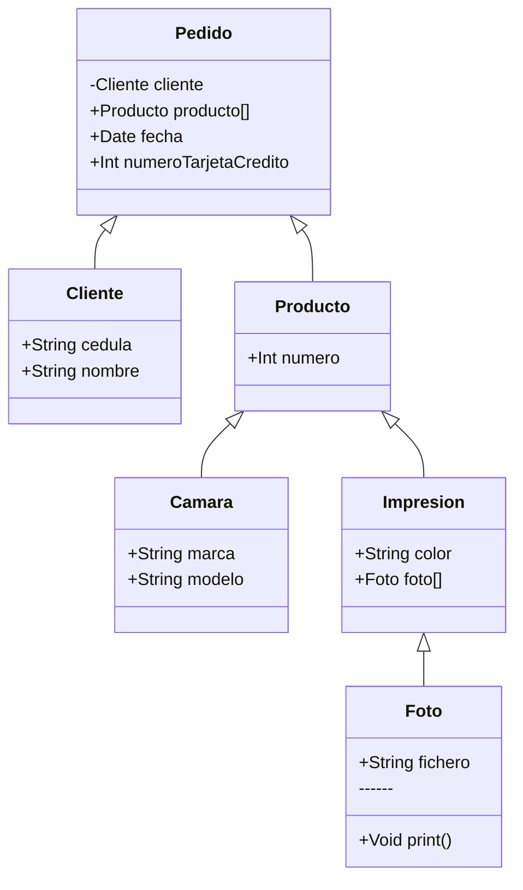

# Validación: Estructura de Datos

**Estudiante**: Johan Camilo Muelas Vernaza  
**Profesores** Asignados:

* Víctor David Mosquera Fernández
* Jhon Haide Cano Beltrán

Los conceptos de la Programación Orientada a Objetos gravitan en conceptos muy bien
definidos (Pilares de la POO, Clase, Atributos, Objetos, relaciones de Composición,
Agregación y Uso, Herencia, Polimorfismo, Interfaces, Clases Abstractas, entre otros). Para
la validación se espera que el estudiante tenga claro los conceptos anteriormente
mencionados, y las estructuras de datos como pilas, colas, listas y mapas, para lo cual será
importante revisar y analizar de manera atenta el siguiente Diagrama de Clases.

Usted deberá implementar el código en lenguaje de programación JAVA, con su respectiva
ejecución y casos de prueba, si requiere refinar el modelo, está en libertad para agregar
atributos y métodos que permitan orientar la ejecución según su abstracción y
modelamiento, posteriormente, debe explicar de manera clara y concisa los siguientes
conceptos que se encuentran dentro del modelo planteado.

1. Herencia y polimorfismo
2. Composición y agregación
3. ¿Cuál clase podría convertirse en una interfaz o clase abstracta para generar un
modelo mucho mas estructurado?
4. ¿Qué estructuras de datos nos permitirían manejar mucho mejor la información del
modelo?
