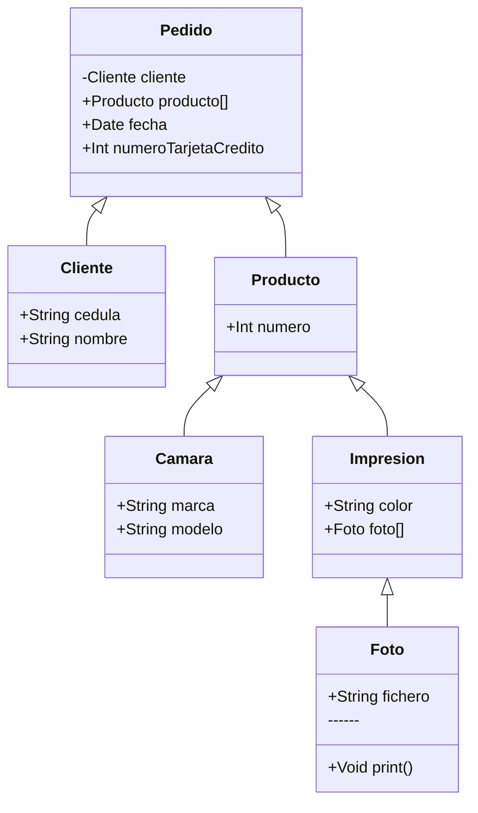

# Validación: Estructura de Datos

**Estudiante**: Johan Camilo Muelas Vernaza  
**Profesores** Asignados:

* Víctor David Mosquera Fernández
* Jhon Haide Cano Beltrán

Los conceptos de la Programación Orientada a Objetos gravitan en conceptos muy bien
definidos (Pilares de la POO, Clase, Atributos, Objetos, relaciones de Composición,
Agregación y Uso, Herencia, Polimorfismo, Interfaces, Clases Abstractas, entre otros). Para
la validación se espera que el estudiante tenga claro los conceptos anteriormente
mencionados, y las estructuras de datos como pilas, colas, listas y mapas, para lo cual será
importante revisar y analizar de manera atenta el siguiente Diagrama de Clases.



Usted deberá implementar el código en lenguaje de programación JAVA, con su respectiva
ejecución y casos de prueba, si requiere refinar el modelo, está en libertad para agregar
atributos y métodos que permitan orientar la ejecución según su abstracción y
modelamiento, posteriormente, debe explicar de manera clara y concisa los siguientes
conceptos que se encuentran dentro del modelo planteado.

1. Herencia y polimorfismo
2. Composición y agregación
3. ¿Cuál clase podría convertirse en una interfaz o clase abstracta para generar un
modelo mucho mas estructurado?
4. ¿Qué estructuras de datos nos permitirían manejar mucho mejor la información del
modelo?

# Desarrollo

## Construccion de clases

### Cliente

```javascript
class Cliente {
    constructor(cedula, nombre) {
        this.cedula = cedula;
        this.nombre = nombre;
    }
}
```

### Pedido

```javascript
class Pedido {
    constructor(cliente, productos, fecha, numeroTarjetaCredito) {
        this.cliente = cliente;
        this.productos = productos;
        this.fecha = fecha;
        this.numeroTarjetaCredito = numeroTarjetaCredito;
    }
}
```

### Producto

```javascript
class Producto {
    constructor(numero) {
        this.numero = numero;
    }
}
```

### Camara

```javascript
class Camara extends Producto {
    constructor(numero, marca, modelo) {
        super(numero);
        this.marca = marca;
        this.modelo = modelo;
    }
}
```

### Impresion

```javascript
class Impresion extends Producto {
    constructor(numero, color, fotos) {
        super(numero);
        this.color = color;
        this.fotos = fotos;
    }
}
```

### Foto

```javascript
class Foto {
    constructor(fichero) {
        this.fichero = fichero;
    }

    print() {
        console.log(`Printing ${this.fichero}`);
    }
}
```

## Implementacion de las clases

* <App/>

## Estructuras de Datos

### Lista Simple

```javascript
class Nodo {
    constructor(dato) {
        this.dato = dato;
        this.siguiente = null;
    }
}

class ListaSimple {
    constructor() {
        this.cabeza = null;
    }

    agregar(dato) {
        const nuevoNodo = new Nodo(dato);
        if (this.cabeza === null) {
            this.cabeza = nuevoNodo;
        } else {
            let temp = this.cabeza;
            while (temp.siguiente !== null) {
                temp = temp.siguiente;
            }
            temp.siguiente = nuevoNodo;
        }
    }

    imprimir() {
        let temp = this.cabeza;
        while (temp !== null) {
            console.log(temp.dato);
            temp = temp.siguiente;
        }
    }
}
```

### Lista Doblemente Enlazada

```javascript
class NodoDoble {
    constructor(dato) {
        this.dato = dato;
        this.siguiente = null;
        this.anterior = null;
    }
}

class ListaDoble {
    constructor() {
        this.cabeza = null;
        this.cola = null;
    }

    agregar(dato) {
        const nuevoNodo = new NodoDoble(dato);
        if (this.cola === null) {
            this.cabeza = this.cola = nuevoNodo;
        } else {
            this.cola.siguiente = nuevoNodo;
            nuevoNodo.anterior = this.cola;
            this.cola = nuevoNodo;
        }
    }

    imprimir() {
        let temp = this.cabeza;
        while (temp !== null) {
            console.log(temp.dato);
            temp = temp.siguiente;
        }
    }
}
```

### Lista Circular

```javascript
class NodoCircular {
    constructor(dato) {
        this.dato = dato;
        this.siguiente = null;
    }
}

class ListaCircular {
    constructor() {
        this.cabeza = null;
    }

    agregar(dato) {
        const nuevoNodo = new NodoCircular(dato);
        if (this.cabeza === null) {
            this.cabeza = nuevoNodo;
            nuevoNodo.siguiente = this.cabeza;
        } else {
            let temp = this.cabeza;
            while (temp.siguiente !== this.cabeza) {
                temp = temp.siguiente;
            }
            temp.siguiente = nuevoNodo;
            nuevoNodo.siguiente = this.cabeza;
        }
    }

    imprimir() {
        if (this.cabeza !== null) {
            let temp = this.cabeza;
            do {
                console.log(temp.dato);
                temp = temp.siguiente;
            } while (temp !== this.cabeza);
        }
    }
}
```

### Pila

```javascript
class Pila {
    constructor() {
        this.elementos = [];
    }

    push(elemento) {
        this.elementos.push(elemento);
    }

    pop() {
        return this.elementos.pop();
    }

    estaVacia() {
        return this.elementos.length === 0;
    }
}

// Uso
const pila = new Pila();
pila.push(1);
pila.push(2);
pila.push(3);
while (!pila.estaVacia()) {
    console.log(pila.pop());
}
```

### Cola 

```javascript
class Cola {
    constructor() {
        this.elementos = [];
    }

    encolar(elemento) {
        this.elementos.push(elemento);
    }

    desencolar() {
        return this.elementos.shift();
    }

    estaVacia() {
        return this.elementos.length === 0;
    }
}

// Uso
const cola = new Cola();
cola.encolar(1);
cola.encolar(2);
cola.encolar(3);
while (!cola.estaVacia()) {
    console.log(cola.desencolar());
}
```

### Árbol Binario

```javascript
class NodoArbol {
    constructor(dato) {
        this.dato = dato;
        this.izquierdo = null;
        this.derecho = null;
    }
}

class ArbolBinario {
    constructor() {
        this.raiz = null;
    }

    agregar(dato) {
        this.raiz = this.agregarRecursivo(this.raiz, dato);
    }

    agregarRecursivo(nodo, dato) {
        if (nodo === null) {
            return new NodoArbol(dato);
        }
        if (dato < nodo.dato) {
            nodo.izquierdo = this.agregarRecursivo(nodo.izquierdo, dato);
        } else if (dato > nodo.dato) {
            nodo.derecho = this.agregarRecursivo(nodo.derecho, dato);
        }
        return nodo;
    }

    recorrerInOrden() {
        this.recorrerInOrdenRecursivo(this.raiz);
    }

    recorrerInOrdenRecursivo(nodo) {
        if (nodo !== null) {
            this.recorrerInOrdenRecursivo(nodo.izquierdo);
            console.log(nodo.dato);
            this.recorrerInOrdenRecursivo(nodo.derecho);
        }
    }
}
```

### Árbol AVL

```javascript
class NodoAVL {
    constructor(dato) {
        this.dato = dato;
        this.altura = 1;
        this.izquierdo = null;
        this.derecho = null;
    }
}

class ArbolAVL {
    constructor() {
        this.raiz = null;
    }

    altura(nodo) {
        return nodo ? nodo.altura : 0;
    }

    max(a, b) {
        return a > b ? a : b;
    }

    rotarDerecha(y) {
        const x = y.izquierdo;
        const T2 = x.derecho;

        x.derecho = y;
        y.izquierdo = T2;

        y.altura = this.max(this.altura(y.izquierdo), this.altura(y.derecho)) + 1;
        x.altura = this.max(this.altura(x.izquierdo), this.altura(x.derecho)) + 1;

        return x;
    }

    rotarIzquierda(x) {
        const y = x.derecho;
        const T2 = y.izquierdo;

        y.izquierdo = x;
        x.derecho = T2;

        x.altura = this.max(this.altura(x.izquierdo), this.altura(x.derecho)) + 1;
        y.altura = this.max(this.altura(y.izquierdo), this.altura(y.derecho)) + 1;

        return y;
    }

    getBalance(nodo) {
        return nodo ? this.altura(nodo.izquierdo) - this.altura(nodo.derecho) : 0;
    }

    agregar(dato) {
        this.raiz = this.agregarRecursivo(this.raiz, dato);
    }

    agregarRecursivo(nodo, dato) {
        if (!nodo) {
            return new NodoAVL(dato);
        }

        if (dato < nodo.dato) {
            nodo.izquierdo = this.agregarRecursivo(nodo.izquierdo, dato);
        } else if (dato > nodo.dato) {
            nodo.derecho = this.agregarRecursivo(nodo.derecho, dato);
        } else {
            return nodo;
        }

        nodo.altura = 1 + this.max(this.altura(nodo.izquierdo), this.altura(nodo.derecho));

        const balance = this.getBalance(nodo);

        if (balance > 1 && dato < nodo.izquierdo.dato) {
            return this.rotarDerecha(nodo);
        }

        if (balance < -1 && dato > nodo.derecho.dato) {
            return this.rotarIzquierda(nodo);
        }

        if (balance > 1 && dato > nodo.izquierdo.dato) {
            nodo.izquierdo = this.rotarIzquierda(nodo.izquierdo);
            return this.rotarDerecha(nodo);
        }

        if (balance < -1 && dato < nodo.derecho.dato) {
            nodo.derecho = this.rotarDerecha(nodo.derecho);
            return this.rotarIzquierda(nodo);
        }

        return nodo;
    }

    recorrerInOrden() {
        this.recorrerInOrdenRecursivo(this.raiz);
    }

    recorrerInOrdenRecursivo(nodo) {
        if (nodo !== null) {
            this.recorrerInOrdenRecursivo(nodo.izquierdo);
            console.log(nodo.dato);
            this.recorrerInOrdenRecursivo(nodo.derecho);
        }
    }
}
```

### Grafos

```javascript
class NodoGrafo {
    constructor(valor) {
        this.valor = valor;
        this.vecinos = [];
    }

    agregarVecino(nodo, peso = 1) {
        this.vecinos.push({ nodo, peso });
    }
}

class Grafo {
    constructor() {
        this.nodos = new Map();
    }

    agregarNodo(valor) {
        const nodo = new NodoGrafo(valor);
        this.nodos.set(valor, nodo);
    }

    agregarArista(origen, destino, peso = 1) {
        const nodoOrigen = this.nodos.get(origen);
        const nodoDestino = this.nodos.get(destino);
        if (nodoOrigen && nodoDestino) {
            nodoOrigen.agregarVecino(nodoDestino, peso);
            nodoDestino.agregarVecino(nodoOrigen, peso); // Grafo no dirigido
        }
    }

    // Algoritmo de búsqueda A*
    busquedaAEstrella(inicio, objetivo, heuristica) {
        const inicioNodo = this.nodos.get(inicio);
        const objetivoNodo = this.nodos.get(objetivo);
        const abiertos = new Set([inicioNodo]);
        const cerrados = new Set();
        const g = new Map();
        const f = new Map();
        const camino = new Map();
        g.set(inicioNodo, 0);
        f.set(inicioNodo, heuristica(inicioNodo, objetivoNodo));

        while (abiertos.size > 0) {
            const nodoActual = Array.from(abiertos).reduce((a, b) => f.get(a) < f.get(b) ? a : b);
            if (nodoActual === objetivoNodo) {
                return this.reconstruirCamino(camino, objetivoNodo);
            }

            abiertos.delete(nodoActual);
            cerrados.add(nodoActual);

            for (const { nodo: vecino, peso } of nodoActual.vecinos) {
                if (cerrados.has(vecino)) {
                    continue;
                }

                const tentativeG = g.get(nodoActual) + peso;
                if (!abiertos.has(vecino)) {
                    abiertos.add(vecino);
                } else if (tentativeG >= g.get(vecino)) {
                    continue;
                }

                camino.set(vecino, nodoActual);
                g.set(vecino, tentativeG);
                f.set(vecino, g.get(vecino) + heuristica(vecino, objetivoNodo));
            }
        }

        return null; // No se encontró camino
    }

    reconstruirCamino(camino, nodoActual) {
        const caminoCompleto = [];
        while (nodoActual) {
            caminoCompleto.push(nodoActual);
            nodoActual = camino.get(nodoActual);
        }
        return caminoCompleto.reverse();
    }
}
```

### Matriz Dispersa

```javascript
class MatrizDispersa {
    constructor(filas, columnas) {
        this.filas = filas;
        this.columnas = columnas;
        this.datos = new Map();
    }

    agregarElemento(fila, columna, valor) {
        if (fila >= this.filas || columna >= this.columnas || fila < 0 || columna < 0) {
            throw new Error("Índice fuera de los límites");
        }
        if (valor !== 0) {
            if (!this.datos.has(fila)) {
                this.datos.set(fila, new Map());
            }
            this.datos.get(fila).set(columna, valor);
        }
    }

    obtenerElemento(fila, columna) {
        if (fila >= this.filas || columna >= this.columnas || fila < 0 || columna < 0) {
            throw new Error("Índice fuera de los límites");
        }
        return this.datos.get(fila)?.get(columna) || 0;
    }

    imprimirMatriz() {
        for (let i = 0; i < this.filas; i++) {
            let fila = "";
            for (let j = 0; j < this.columnas; j++) {
                fila += this.obtenerElemento(i, j) + " ";
            }
            console.log(fila);
        }
    }
}
```
